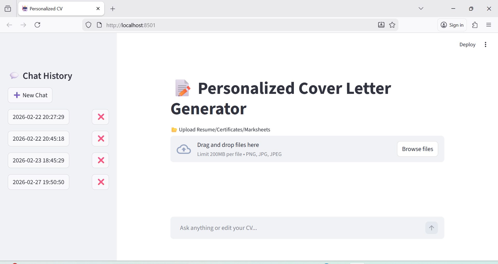
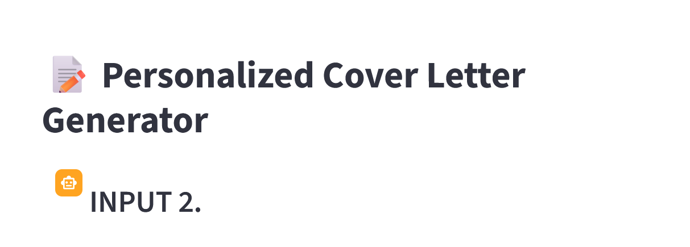
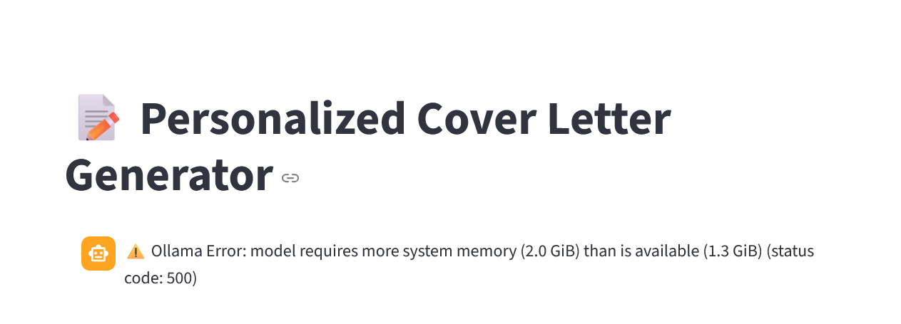

# PCV – Personalized Cover Letter Generator


PCV (Personalized Cover Letter Generator) is an AI-powered application that automates the process of creating professional and customized cover letters. The system analyzes a candidate’s resume along with a job description and generates a tailored cover letter aligned with the employer’s requirements and the applicant’s skills.

This project helps job seekers streamline their job applications by generating high-quality, role-specific cover letters quickly and efficiently.

---

# 🚀 Features

- 📄 **Resume Text Extraction**
  - Extracts resume content using Optical Character Recognition (OCR).

- 🤖 **AI Cover Letter Generation**
  - Generates personalized cover letters using AI models.

- 📊 **Job Description Analysis**
  - Identifies relevant skills and qualifications from job descriptions.

- 🌐 **Interactive Web Interface**
  - Built with Streamlit for a simple and user-friendly experience.

- 📥 **PDF Export**
  - Allows users to download generated cover letters in professional PDF format.

- 🧠 **Chat History Support**
  - Stores previously generated cover letters for reference.

- ⚡ **Efficient Workflow**
  - Reduces manual effort in preparing job application documents.

---

# 🛠️ Technology Stack

| Technology | Purpose |
|-----------|--------|
| Python | Core programming language |
| Streamlit | Web interface |
| PaddleOCR | Resume text extraction |
| PIL | Image processing |
| FPDF | PDF generation |
| Ollama (Phi Model) | AI text generation |

---

# 🏗 System Architecture


---

# 📂 Project Structure


Personalized-Cover-Letter-Generator/PCV
│
├── DejaVuSansCondensed.cw127.pkl
├── DejaVuSansCondensed.pkl
├── DejaVuSansCondensed.ttf
├── chats.json
├── gencv.py
├── requirements.txt
│
├── assets/
│   └── images
│
├── LICENSE 
│
└── README.md


---

# ⚙️ Installation

Clone the repository

```bash
git clone https://github.com/HARSHINISHIRI/Personalized-Cover-Letter-Generator--PCV.git
cd Personalized-Cover-Letter-Generator--PCV
````

Install dependencies

```bash
pip install -r requirements.txt
```

Run the application

```bash
streamlit run app.py
```

---

# 📌 Usage

1. Start the Streamlit application.
2. Upload your resume.
3. Upload the job description.
4. Generate a personalized cover letter.
5. Download the cover letter as a PDF.

---

# 🖼 Screenshots

### UI of Generated Cover Letter




### Error faced during project 

These errors happens, only when you use small models or System Requirement is less than 8 RAM or Less.

ERROR 1: Garbage 


ERROR 2: 


---

# 🔮 Future Improvements

* Multi-language support
* ATS compatibility scoring
* Resume skill gap analysis
* Integration with job portals
* Cloud deployment

---

# 📄 License

This project is developed for educational and research purposes.

```

